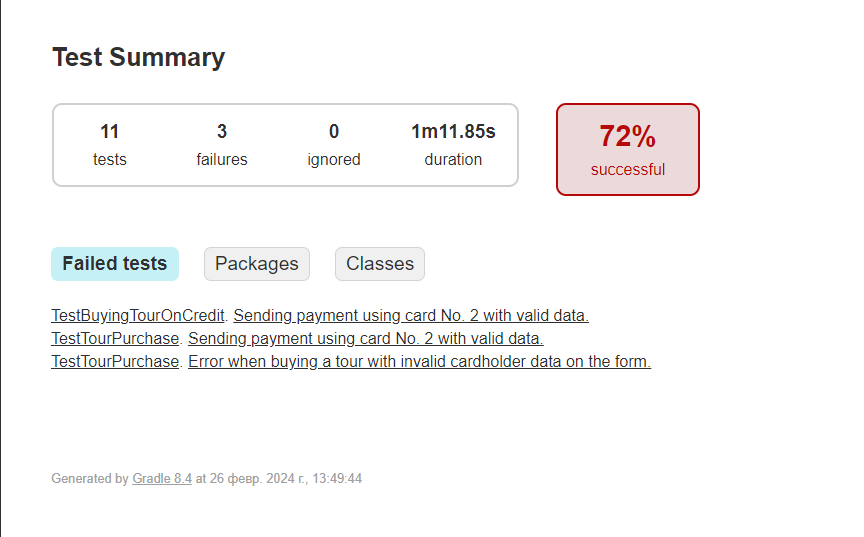

# Отчёт о проведённой автоматизации:

Реализованы все запланированные сценарии:

**Успешные сценарии по оплате картой:**

1. Покупка тура при заполнении формы валидными данными.
2. Отказ формы при не заполненными данными.
3. Отказ формы от карты с истекшим сроком.
4. Отказ формы при заполнении не валидным CVC кодом. 

**Успешные сценарии при покупке в кредит:**

1. Покупка в кредит тур при заполнении формы валидными данными.
2. Отказ формы при не заполненными данными.

**Не успешные сценарии:**
1. Ошибка при покупке\кредит тура с невалидными данными карты на форме.
2. Ошибка при покупке тура с невалидными данными владельца карты на форме.
3. Ошибка при покупке тура с валидными данными карты на форме.

### количество тест-кейсов
Из 11 тест-кейсов: 3 не прошли, 8 прошли.
Итого: 72% успешных тестов / 28% неуспешных тестов

**При автоматизации сработали риски:**

* Недостаток навыков и знаний в части подключения к нескольким БД.

**Общий итог по времени:**

Запланировано было 48 часов. На выполнение потрачено 36 с учетом сработавших рисков. 